<p align="center">
	
</p>

<h1 align='center'>PageSpeed Insights for README</h1>


> Embed your website's pagespeed score to your readme


⚠️ :warning: Under maintainance 🔧 :wrench:

### About PageSpeed Insights
PageSpeed Insights analyzes the content of a web page, then generates suggestions to make that page faster. [Learn more](https://developers.google.com/speed/docs/insights/about/).


## Info

### Guages
<p align="center">
	
</p>

### PWA
<p align="center">
	
</p>

## API and Usage

__Important note: Do not embed url to readme, instead embed generated svg__
- It takes time to perform audits of website. So embedding it directly in readme would not render due to server timeout. Instead you must first visit and download the svg from the api (by simply visiting api url with desired parameters). And then embed that svg to your README files.
- Typically it takes 10-15 seconds to obtain the results from pagespeed api
- Some servers don't allow (eg. google.com) or delay (eg. cloudflare) pagespeed crawler, so it may result in unexpected results.
- The result may fluctuate slightly sometimes.

### API url
The api is called from `https://pagespeed-insights.herokuapp.com`

### Simple usage
In simple form it will return result for all categories for desktop version of your website. Replace `your_website_url` with your website's url
```md
https://pagespeed-insights.herokuapp.com?url=your_website_url
```
For example
```md
https://pagespeed-insights.herokuapp.com?url=https://ankurparihar.github.io
```

### Theme
Default result is theme-agnostic i.e. looks good in both light and dark environment. But you can force one of two additional themes that are `light` and `dark`.
```md
https://pagespeed-insights.herokuapp.com?url=your_website_url&theme=dark
```

### Strategy
Strategy specifies the type of device your website is audited for. You can specify strategy as either `mobile` or `desktop`. If none is specified `desktop` is chosen
```md
https://pagespeed-insights.herokuapp.com?url=your_website_url&strategy=mobile
```

### Category
There are 5 categories (in order)
- Performance
- Accessibility
- Best Practices
- SEO
- Progressive Web App

By default all the categories are evaluated, but you can specify which categories to evaluate. The category parameter is a number. This is 5-bit number in binary, where if a bit is 1 then the corresponding category will be included.
For example 
```
+------------+------------+------------+------------+------------+
|   Perf.    |    Acc.    |  Best pr.  |     SEO    |     PWA    |
+------------+------------+------------+------------+------------+
|      1     |      0     |      1     |      1     |      1     | => 0x10111 => 23
+------------+------------+------------+------------+------------+
```

#### Only performance
```md
https://pagespeed-insights.herokuapp.com?url=your_website_url&categories=16
```

#### All but PWA
```md
https://pagespeed-insights.herokuapp.com?url=your_website_url&categories=30
```


### Accuracy

Performance is volatile so you can request up to 3 performance tests to retrieve more precise results
```md
https://pagespeed-insights.herokuapp.com?url=your_website_url&tests=30
```

### Embedding into readme
After downloading svg you can embed into readme as following
- markdown method
```

```
- html method
```html
<p align="center">	<!-- (optional) center align -->
    
</p>
```

### Keep results updated with action workflow
- [pagespeed.yml](.github/workflows/pagespeed.yml)

### Example
- [ankurparihar.github.io](https://github.com/ankurparihar/ankurparihar.github.io#readme)